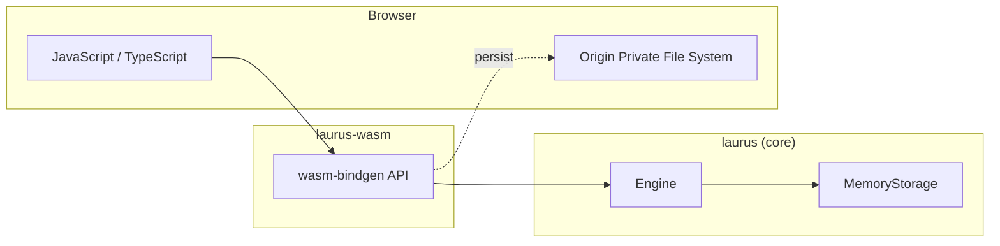

# WASM Binding Overview

The `laurus-wasm` package provides WebAssembly bindings for the
Laurus search engine. It enables lexical, vector, and hybrid search
directly in browsers and edge runtimes (Cloudflare Workers,
Vercel Edge Functions, Deno Deploy) without a server.

## Features

- **Lexical Search** -- Full-text search powered by an inverted
  index with BM25 scoring
- **Vector Search** -- Approximate nearest neighbor (ANN) search
  using Flat, HNSW, or IVF indexes
- **Hybrid Search** -- Combine lexical and vector results with
  fusion algorithms (RRF, WeightedSum)
- **Rich Query DSL** -- Term, Phrase, Fuzzy, Wildcard,
  NumericRange, Geo, Boolean, Span queries
- **Text Analysis** -- Tokenizers, filters, and synonym expansion
- **In-memory Storage** -- Fast ephemeral indexes
- **OPFS Persistence** -- Indexes survive page reloads via the
  Origin Private File System
- **TypeScript Types** -- Auto-generated `.d.ts` type definitions
- **Async API** -- All I/O operations return Promises

## Architecture



## Limitation: No In-Engine Auto-Embedding

One of Laurus's key features on native platforms is **automatic embedding** --
when a document is indexed, the engine can automatically convert text fields
into vector embeddings using a registered embedder (Candle BERT, Candle CLIP,
or OpenAI API). This allows `searchVectorText("field", "query text")` to
work seamlessly without the caller computing embeddings.

**In laurus-wasm, this feature is not available.** Only the `precomputed`
embedder type is supported. The reasons are:

| Embedder      | Dependency        | Why it cannot run in WASM                                   |
| ------------- | ----------------- | ----------------------------------------------------------- |
| `candle_bert` | candle (GPU/SIMD) | Requires native SIMD intrinsics and file system for models  |
| `candle_clip` | candle            | Same as above                                               |
| `openai`      | reqwest (HTTP)    | Requires a full async HTTP client (tokio + TLS)             |

These dependencies are excluded from the WASM build via feature flags
(`embeddings-candle`, `embeddings-openai`), which depend on the `native`
feature that is disabled for `wasm32-unknown-unknown`.

### Recommended Alternative

Compute embeddings on the **JavaScript side** and pass precomputed vectors
to `putDocument()` and `searchVector()`:

```javascript
// Using Transformers.js (all-MiniLM-L6-v2, 384-dim)
import { pipeline } from '@huggingface/transformers';

const embedder = await pipeline('feature-extraction', 'Xenova/all-MiniLM-L6-v2');

async function embed(text) {
  const output = await embedder(text, { pooling: 'mean', normalize: true });
  return Array.from(output.data);
}

// Index with precomputed embedding
const vec = await embed("Introduction to Rust");
await index.putDocument("doc1", { title: "Introduction to Rust", embedding: vec });
await index.commit();

// Search with precomputed query embedding
const queryVec = await embed("safe systems programming");
const results = await index.searchVector("embedding", queryVec);
```

This approach gives you real semantic search in the browser using the same
sentence-transformer models available on native platforms, with the embedding
computation handled by Transformers.js (ONNX Runtime Web) instead of candle.

## When to Use laurus-wasm vs laurus-nodejs

| Criterion   | `laurus-wasm`              | `laurus-nodejs`               |
| ----------- | -------------------------- | ----------------------------- |
| Environment | Browser, Edge Runtime      | Node.js server                |
| Performance | Good (single-threaded)     | Best (native, multi-threaded) |
| Storage     | In-memory + OPFS           | In-memory + File system       |
| Embedding   | Precomputed only           | Candle, OpenAI, Precomputed   |
| Package     | `npm install laurus-wasm`  | `npm install laurus-nodejs`   |
| Binary size | ~5-10 MB (WASM)            | Platform-native               |
