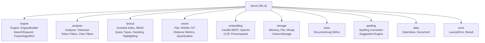

# Library Overview

The `laurus` crate is the core search engine library. It provides lexical search (keyword matching via inverted index), vector search (semantic similarity via embeddings), and hybrid search (combining both) through a unified API.

## Module Structure



## Key Types

| Type | Module | Description |
| :--- | :--- | :--- |
| `Engine` | `engine` | Unified search engine coordinating lexical and vector search |
| `EngineBuilder` | `engine` | Builder pattern for configuring and creating an Engine |
| `Schema` | `engine` | Field definitions and routing configuration |
| `SearchRequest` | `engine` | Unified search request (lexical, vector, or hybrid) |
| `FusionAlgorithm` | `engine` | Result merging strategy (RRF or WeightedSum) |
| `Document` | `data` | Collection of named field values |
| `DataValue` | `data` | Unified value enum for all field types |
| `LaurusError` | `error` | Comprehensive error type with variants for each subsystem |

## Feature Flags

The `laurus` crate has no default features enabled. Enable embedding support as needed:

| Feature | Description | Dependencies |
| :--- | :--- | :--- |
| `embeddings-candle` | Local BERT embeddings via Hugging Face Candle | candle-core, candle-nn, candle-transformers, hf-hub, tokenizers |
| `embeddings-openai` | OpenAI API embeddings | reqwest |
| `embeddings-multimodal` | CLIP multimodal embeddings (text + image) | image, embeddings-candle |
| `embeddings-all` | All embedding features combined | All of the above |

```toml
# Lexical search only (no embedding)
[dependencies]
laurus = "0.1.0"

# With local BERT embeddings
[dependencies]
laurus = { version = "0.1.0", features = ["embeddings-candle"] }

# All features
[dependencies]
laurus = { version = "0.1.0", features = ["embeddings-all"] }
```

## Sections

- [Engine](laurus/engine.md) -- Engine and EngineBuilder internals
- [Scoring & Ranking](laurus/scoring.md) -- BM25, TF-IDF, and vector similarity scoring
- [Faceting](laurus/faceting.md) -- Hierarchical facet search
- [Highlighting](laurus/highlighting.md) -- Search result highlighting
- [Spelling Correction](laurus/spelling_correction.md) -- Spelling suggestions and auto-correction
- [ID Management](laurus/id_management.md) -- Dual-tiered document identity
- [Persistence & WAL](laurus/persistence.md) -- Write-ahead logging and durability
- [Deletions & Compaction](laurus/deletions.md) -- Logical deletion and space reclamation
- [Error Handling](laurus/error_handling.md) -- LaurusError and Result types
- [Extensibility](laurus/extensibility.md) -- Custom analyzers, embedders, and storage backends
- [API Reference](laurus/api_reference.md) -- Key types and methods at a glance
