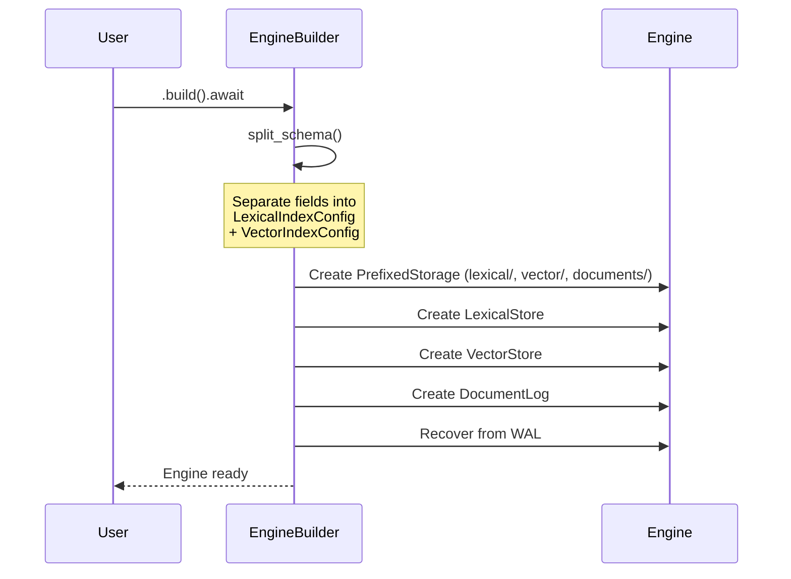
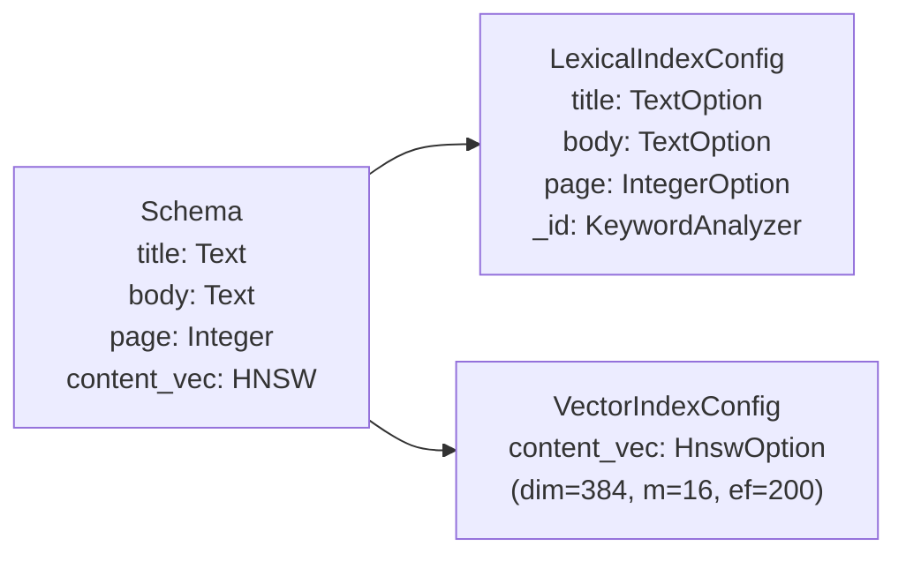
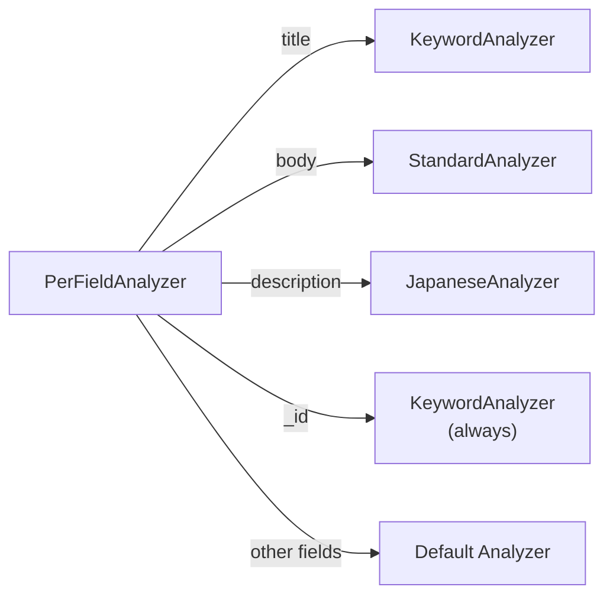
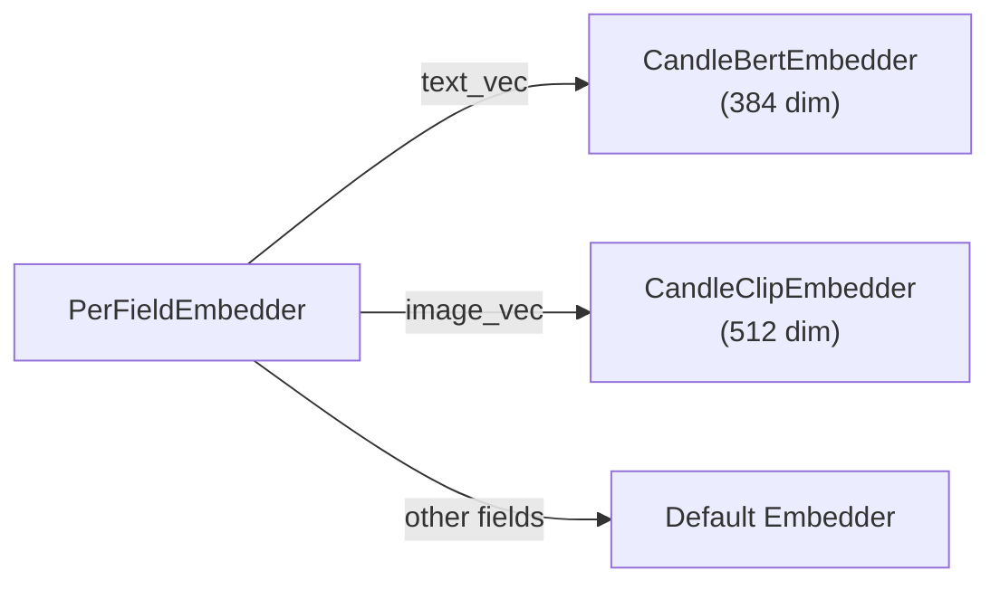

# Engine

The `Engine` is the central type in Laurus. It coordinates the lexical index, vector index, and document log behind a single async API.

## Engine Struct

```rust
pub struct Engine {
    schema: Schema,
    lexical: LexicalStore,
    vector: VectorStore,
    log: Arc<DocumentLog>,
}
```

| Field | Type | Description |
| :--- | :--- | :--- |
| `schema` | `Schema` | Field definitions and routing rules |
| `lexical` | `LexicalStore` | Inverted index for keyword search |
| `vector` | `VectorStore` | Vector index for similarity search |
| `log` | `Arc<DocumentLog>` | Write-ahead log for crash recovery and document storage |

## EngineBuilder

Use `EngineBuilder` to configure and create an Engine:

```rust
use std::sync::Arc;
use laurus::{Engine, Schema};
use laurus::lexical::TextOption;
use laurus::storage::memory::MemoryStorage;

let storage = Arc::new(MemoryStorage::new(Default::default()));
let schema = Schema::builder()
    .add_text_field("title", TextOption::default())
    .add_text_field("body", TextOption::default())
    .add_default_field("body")
    .build();

let engine = Engine::builder(storage, schema)
    .analyzer(my_analyzer)    // optional: custom text analyzer
    .embedder(my_embedder)    // optional: vector embedder
    .build()
    .await?;
```

### Builder Methods

| Method | Parameter | Default | Description |
| :--- | :--- | :--- | :--- |
| `analyzer()` | `Arc<dyn Analyzer>` | `StandardAnalyzer` | Text analysis pipeline for lexical fields |
| `embedder()` | `Arc<dyn Embedder>` | None | Embedding model for vector fields |
| `build()` | -- | -- | Create the Engine (async) |

### Build Lifecycle

When `build()` is called, the following steps occur:



1. **Split schema** -- Lexical fields (Text, Integer, Float, etc.) go to `LexicalIndexConfig`, vector fields (HNSW, Flat, IVF) go to `VectorIndexConfig`
2. **Create prefixed storage** -- Each component gets an isolated namespace (`lexical/`, `vector/`, `documents/`)
3. **Initialize stores** -- `LexicalStore` and `VectorStore` are created with their respective configs
4. **Recover from WAL** -- Any uncommitted operations from a previous session are replayed

## Schema Splitting

The Schema contains both lexical and vector fields. At build time, `split_schema()` separates them:



The reserved `_id` field is always added to the lexical config with `KeywordAnalyzer` for exact match lookups.

## Per-Field Dispatch

### PerFieldAnalyzer

When a `PerFieldAnalyzer` is provided, text analysis is dispatched to field-specific analyzers:



### PerFieldEmbedder

Similarly, `PerFieldEmbedder` routes embedding to field-specific embedders:



## Engine Methods

### Document Operations

| Method | Description |
| :--- | :--- |
| `put_document(id, doc)` | Upsert -- replaces any existing document with the same ID |
| `add_document(id, doc)` | Append -- adds as a new chunk (multiple chunks can share an ID) |
| `get_documents(id)` | Retrieve all documents/chunks by external ID |
| `delete_documents(id)` | Delete all documents/chunks by external ID |
| `commit()` | Flush pending changes to storage (makes documents searchable) |
| `recover()` | Replay WAL to restore uncommitted state after crash |
| `add_field(name, field_option)` | Dynamically add a new field to the schema at runtime |
| `schema()` | Return the current `Schema` |

### Search

| Method | Description |
| :--- | :--- |
| `search(request)` | Execute a unified search (lexical, vector, or hybrid) |

The `search()` method accepts a `SearchRequest` which can contain a lexical query, a vector query, or both. When both are present, results are merged using the specified `FusionAlgorithm`.

```rust
use laurus::{SearchRequestBuilder, LexicalSearchRequest, FusionAlgorithm};
use laurus::lexical::TermQuery;

// Lexical-only search
let request = SearchRequestBuilder::new()
    .lexical_search_request(
        LexicalSearchRequest::new(Box::new(TermQuery::new("body", "rust")))
    )
    .limit(10)
    .build();

// Hybrid search with RRF fusion
let request = SearchRequestBuilder::new()
    .lexical_search_request(lexical_req)
    .vector_search_request(vector_req)
    .fusion_algorithm(FusionAlgorithm::RRF { k: 60.0 })
    .limit(10)
    .build();

let results = engine.search(request).await?;
```

## SearchRequest

| Field | Type | Default | Description |
| :--- | :--- | :--- | :--- |
| `lexical_search_request` | `Option<LexicalSearchRequest>` | None | Lexical query |
| `vector_search_request` | `Option<VectorSearchRequest>` | None | Vector query |
| `limit` | `usize` | 10 | Maximum results to return |
| `offset` | `usize` | 0 | Pagination offset |
| `fusion_algorithm` | `Option<FusionAlgorithm>` | RRF (k=60) | How to merge lexical + vector results |
| `filter_query` | `Option<Box<dyn Query>>` | None | Filter applied to both search types |

## FusionAlgorithm

| Variant | Description |
| :--- | :--- |
| `RRF { k: f64 }` | Reciprocal Rank Fusion -- rank-based combining. Score = sum(1 / (k + rank)). Handles incomparable score magnitudes. |
| `WeightedSum { lexical_weight, vector_weight }` | Weighted combination with min-max score normalization. Weights clamped to [0.0, 1.0]. |

See also: [Architecture](../architecture.md) for the high-level data flow diagrams.
